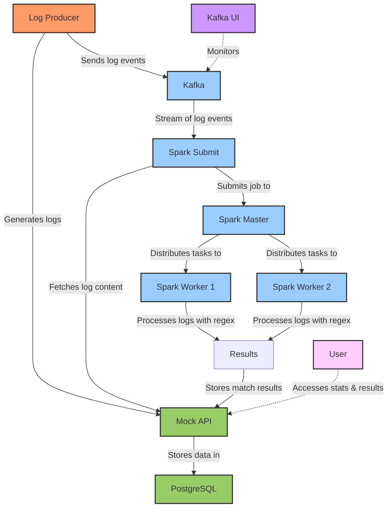

# Distributed Log Processing System with PySpark

This project implements a scalable log processing system using PySpark, Kafka, and PostgreSQL. The system can process log files in real-time, matching various regex patterns to extract important information.

## System Architecture

The system consists of the following components:

- **Log Producer**: Generates sample logs and sends them to the Mock API and Kafka
- **Kafka & Zookeeper**: Messaging system for passing log events
- **Mock API**: RESTful API for storing logs and retrieving results
- **PostgreSQL**: Database for storing logs and regex match results
- **Spark Master & Workers**: Distributed processing engine for analyzing logs
- **Spark Submit**: Service for submitting Spark jobs to the cluster

## System Flow

1. Log Producer generates sample logs and sends them to the Mock API
2. Log Producer notifies Kafka that a new log is available
3. Spark streaming job consumes log events from Kafka
4. Spark job fetches the log content from the Mock API
5. Spark distributes processing across workers to apply regex patterns
6. Results are collected and sent back to the Mock API
7. Results are stored in PostgreSQL for querying

## Prerequisites

- Docker and Docker Compose
- At least 4GB of free RAM
- Port 8080, 8181, 5000, 5432, and 9092 available on the host machine

## Quick Start

1. Clone this repository
2. Make the start script executable: `chmod +x start-system.sh`
3. Run the script: `./start-system.sh`
4. Access the various UIs to monitor the system:
   - Kafka UI: http://localhost:8080
   - Spark Master UI: http://localhost:8181
   - Mock API: http://localhost:5000/health

## Available API Endpoints

The Mock API provides the following endpoints:

- `POST /logs`: Create a new log
- `GET /logs/<log_id>`: Retrieve a log by ID
- `GET /list-logs`: List all log IDs
- `POST /results`: Store regex match results
- `GET /results/<log_id>`: Get regex match results for a specific log
- `GET /stats`: Get statistics on log processing
- `GET /health`: API health check endpoint

## Customizing Regex Patterns

You can customize the regex patterns in the `log_processing_pipeline.py` file. The default patterns include:

- Error messages
- Warning messages
- IP addresses
- Timestamps
- User IDs
- Session IDs
- Request IDs

## Processing Modes

The system supports three processing modes:

1. **Stream Mode** (default): Process logs in real-time as they arrive from Kafka
2. **Batch Mode**: Process all logs in the database in batches
3. **Optimized Mode**: Alternative implementation with more optimized parallel processing

To change the mode, set the `PROCESSING_MODE` environment variable when running the container:

```bash
# In docker-compose.yml
environment:
  PROCESSING_MODE: "batch"  # Options: stream, batch, optimized
```

## Scaling the System

You can scale the system by adding more Spark workers:

```bash
docker-compose up -d --scale spark-worker=5
```

You can also adjust the resources allocated to each worker in the docker-compose.yml file:

```yaml
environment:
  - SPARK_WORKER_MEMORY=2G
  - SPARK_WORKER_CORES=2
```

## Stopping the System

To stop all services:

```bash
docker-compose down -v
```

## Development and Testing

For development and testing, you can run individual components:

```bash
# Run just the database and mock API
docker-compose up -d postgres mock-api

# Run the log producer
docker-compose up -d log-producer

# Run the Spark components
docker-compose up -d spark-master spark-worker-1 spark-worker-2
```

## Troubleshooting

### Kafka Connection Issues

If Spark can't connect to Kafka, check the Kafka broker address and make sure the service is running:

```bash
docker-compose logs kafka
```

### Database Connection Issues

If the Mock API can't connect to PostgreSQL, check the database connection string:

```bash
docker-compose logs mock-api
```

### Spark Job Submission Issues

If the Spark job fails to submit, check the Spark master UI and logs:

```bash
docker-compose logs spark-master
docker-compose logs spark-submit
```

## License

This project is licensed under the MIT License - see the LICENSE file for details.

## System Architecture Diagram

